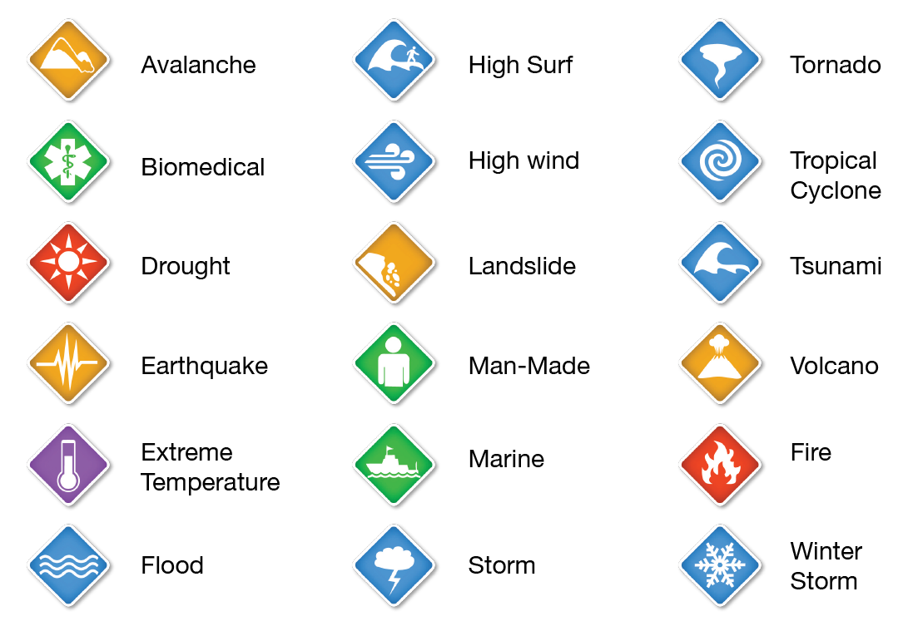

# Monitor and assess multiple hazards
You can monitor multiple hazards in DisasterAWARE. A hazard is displayed in the system when an occurrence or incident poses substantial threat to people, property, or assets as determined by disaster management authorities. 

We continue to add new hazard types as reliable information becomes available.

## Hazard types, symbology and meaning

Below are the types of hazards icons that you may see displayed on the map. 

  
  
Hazards are encoded with additional symbols and colors to indicate the type of occurrence and severity.

