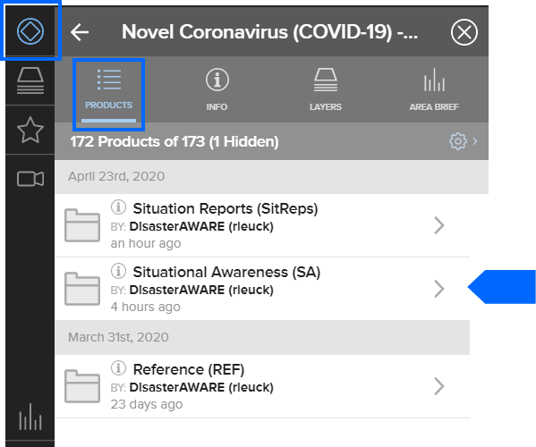
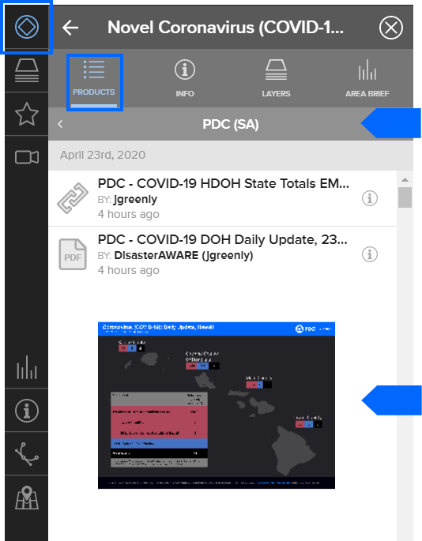
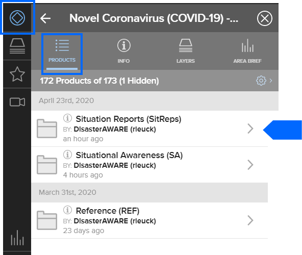
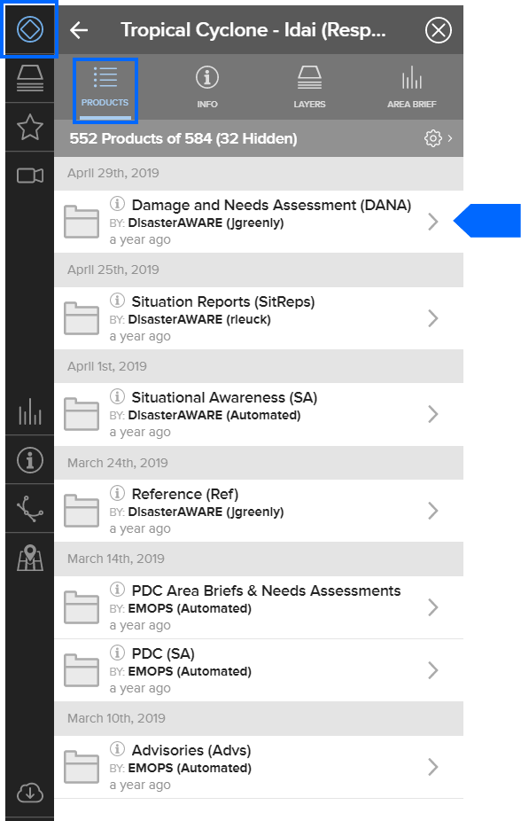
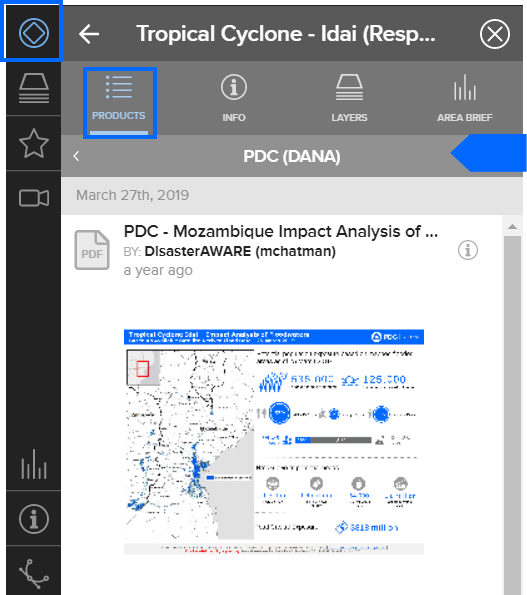
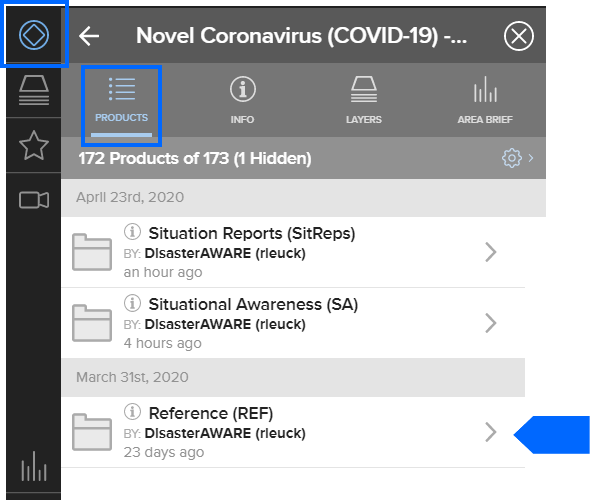

# View situational reports and map products

## Situational awareness maps and products
Hazard > hazard icon > products > Situational Awareness (SA)

These types of maps can ofter be found under Reference and then PDC (SA). 

## Situation reports (Sitreps)
Hazard > hazard icon > products > Situation Reports

## Damage and needs assessments
Hazard > hazard icon > products > Damage And Needs Assessments (DANA)

## Reference maps
Hazard > hazard icon > products > Reference (Ref)

