# GETTING STARTED

DisasterAWARE is the most powerful and reliable early warning and multi-hazard monitoring platform. It is used by thousands of the most demanding government customers and humanitarian assistance organizations around the globe. It supports disaster risk reduction and best practices throughout all phases of disaster management—providing early warning, multi-hazard monitoring, modeled impact assessments, and the largest collection of scientifically verified geospatial data. DisasterAWARE powers [customized software solutions](https://www.pdc.org/solutions/early-warning-and-decision-support-solutions/) for multiple countries around the world, as well as our free mobile app for public use, [Disaster Alert™](https://disasteralert.pdc.org/disasteralert/).

## System Requirements

### Supported browsers

DisasterAWARE is supported on the following browsers:

|                                                               |                       |                                                             |                     |
| ------------------------------------------------------------- | --------------------- | ----------------------------------------------------------- | ------------------- |
|             | Google Chrome 51+     |  | Mozilla Firefox 47+ |
|  | Internet Explorer 11+ |          | Safari 9+           |

### Internet or mobile connection speed

You must have broadband internet with at least a 4 Mbps connection speed, or a 4 G mobile data connection to use DisasterAWARE.

### Desktop monitor size

Desktop computers must have at least a 1024 x 768 resolution monitor to successfully operate the software. We recommend a 1920 x 1200 monitor to ensure the best experience.

### Whitelist pdc.org as a trusted site

Please be sure to whitelist \*.pdc.org as a trusted site in your organization’s firewall rules.

### Configure and optimize your browser

  - PDC uses cookies for session management so please turn on browser cookies and allow pop-ups. Cookies are typically on by default.

  - Make sure your browser zoom is reset to 100% if you are zoomed in further by pressing the Ctrl+0, or Cmd+0 (Mac) keys.

  - Be sure to enable pop-up windows when using DisasterAWARE as many of the features and functions of the system are provided this way.

  - 

## User access and logging in

### Who can access DisasterAWARE?

DisasterAWARE® is free for disaster management practitioners, government agencies, and humanitarian assistance organizations serving local, state, federal, regional, and international disaster management and risk reduction objectives. Access to the system is restricted to these groups in order to ensure uninterrupted system stability and access to critical information supporting public safety in times of disasters.

A free public version of the software is available at [disasteralert.pdc.org,](https://disasteralert.pdc.org/) or by downloading the mobile Disaster Alert app on iTunes or the Google Play Store.

### How to request access

Visit [emops.pdc.org.](https://emops.pdc.org/) Click the **Request Access** link and complete the registration form. You will receive a confirmation within 24 hours of your request.

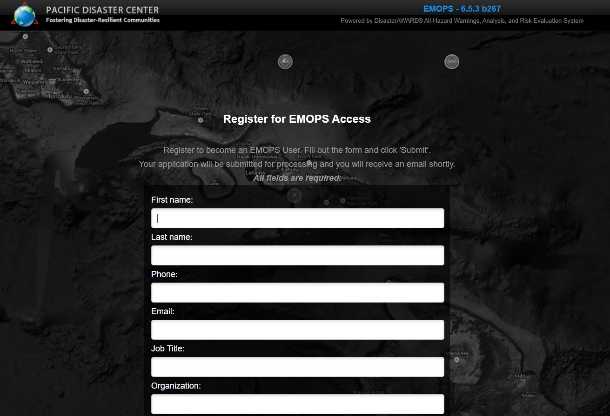

### How to log in to DisasterAWARE

Once access is approved, visit [the link provided in your confirmation email](http://emops.pdc.org/) and login with the username and temporary password provided. Please take a moment to change your password.

|                                         |                                                                                                                                                                             |
| --------------------------------------- | --------------------------------------------------------------------------------------------------------------------------------------------------------------------------- |
|  | To change your password, click the **User** icon from the left toolbar and then click **Account \> Change Password**. To logout, click on the **User** icon and **Logout**. |

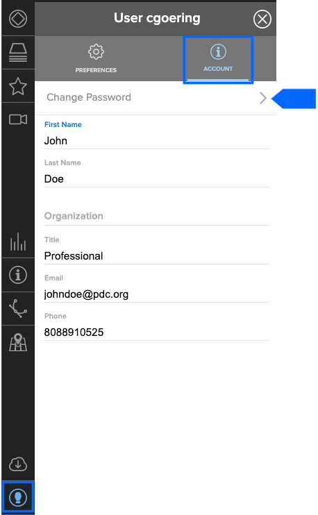

### Trouble logging in?

If you are having trouble logging in, visit the login page and try the "Forgot Password" link. If you still need assistance, contact us at: <disaster@pdc.org>.

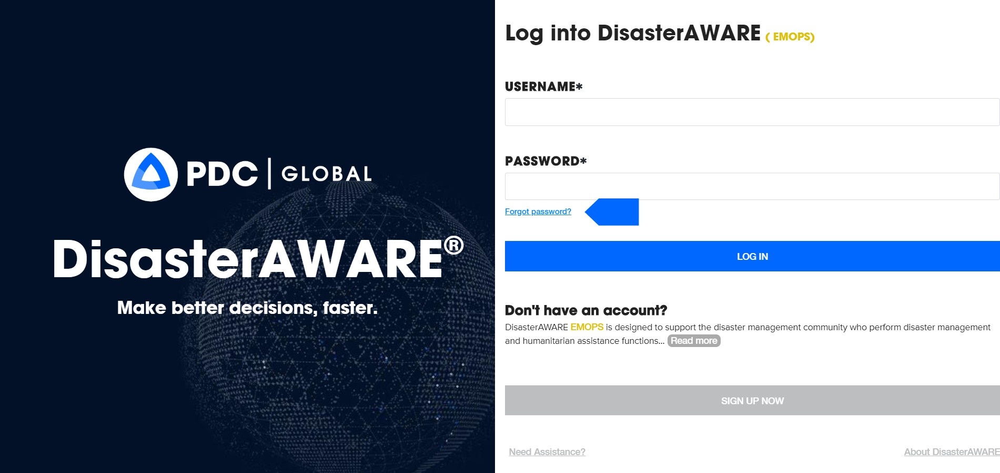

## Map navigation basics

DisasterAWARE allows you to monitor hazards around the globe and to assess potential threats to people, property, or critical assets.

Below is a diagram highlighting the basic elements of the system and how to use the map to monitor current hazards. These features are explained in greater detail in the sections to follow.

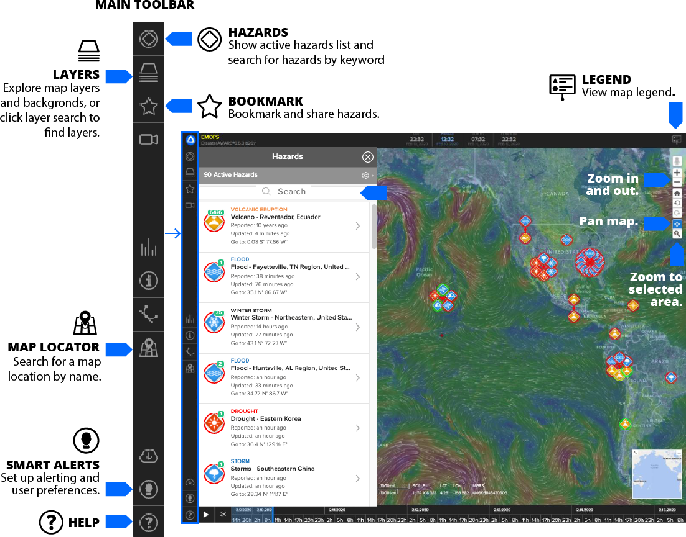

### Main toolbar

To the left, is the main toolbar which provides access to the core features of DisasterAWARE.

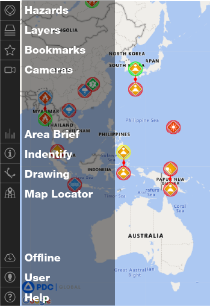

### Mobile navigation

On mobile devices, the toolbar menu is located at the bottom right of the screen and provides access the core features of DisasterAWARE. Make sure you close any open panels in order to see the menu icon.

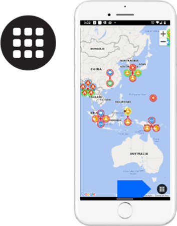

**Mobile scrolling / panning**

While on a mobile device, swipe left or right, or up and down using your fingers to scroll / pan the map.

**Mobile zooming**

While on a mobile device, pinch open or pinch close to zoom in or out on the map.

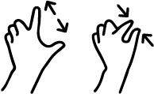

### 

### Zooming the map 

You may zoom in or out on the map using toolbar on the right of the screen.

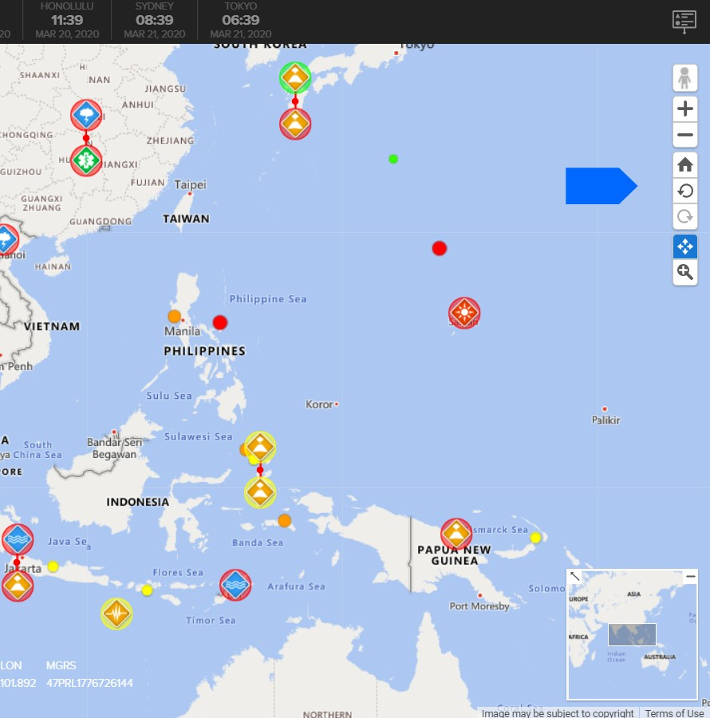

|                                                                                                  |                                                                                                                                                                                                                                                      |
| ------------------------------------------------------------------------------------------------ | ---------------------------------------------------------------------------------------------------------------------------------------------------------------------------------------------------------------------------------------------------- |
|  | Be sure your browser zoom settings are reset to 100%. If the browser window is zoomed in or out, it may result in an optimized screen view with fewer features. Press “Ctrl + 0” keys (or “Cmd + 0” on a Mac) to reset your browser’s zoom settings. |

Click the the “+” and “–” options in the right toolbar. DO NOT use “Ctrl +” or “Ctrl –” key commands as these will zoom your whole browser, which always needs to be set to 100%.  
  
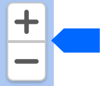

You may also zoom in and out using a trackpad or the scroller on your mouse.

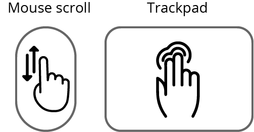

**Pro Tip:** You can zoom to an area of interest by double clicking that location on the map.

**Zoom selector:** Click and drag to create to select a rectangular area in which to zoom.

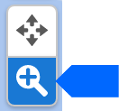

###   

### Panning the map

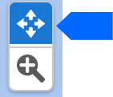When selected, you can click and hold and drag the mouse to pan the map, or swipe with your finger on a mobile device.

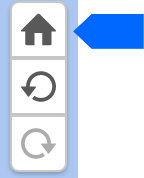**Home position:** Use the home button to return to your default map and zoom position.

**Undo or redo:** to return to previous zoom positions.

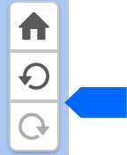

## Layers panel

|                                                                  |                                                                                                                                                                                                 |
| ---------------------------------------------------------------- | ----------------------------------------------------------------------------------------------------------------------------------------------------------------------------------------------- |
|  | Click the **Layers** icon from the left toolbar to open the **Layers** panel. The **Layers panel** categorizes layers thematically into folders. Open a folder to explore the layers available. |

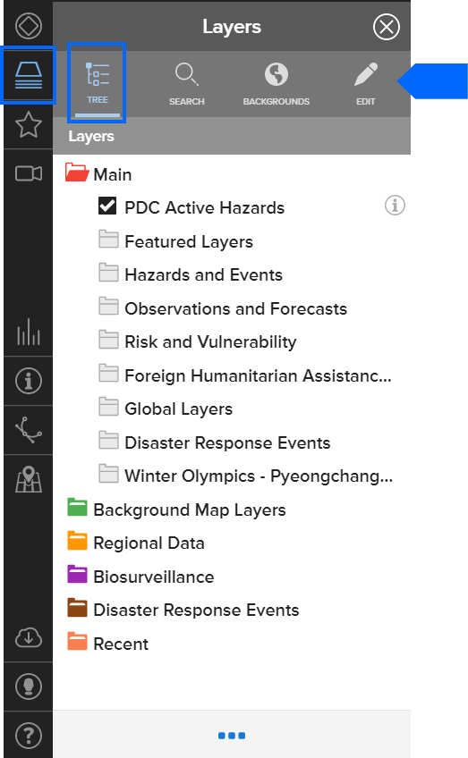

### Layers search

Select the **Layers \> Search tab** to search for available information and layers by keyword. The **Search** tab also allows you to quickly find which layers are turned on. Active layers are denoted by a check box next to the layer name.

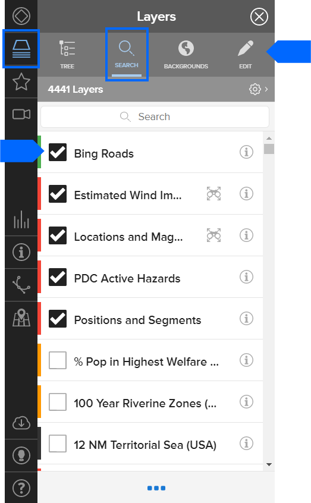

While in the **Layers Search panel**, enter a keyword search (e.g. "Philippines schools") to show the available layers in the system. Click on the check box to display the layer on the map. Learn more about [layers to support situational awareness](file:///tutorial/explore-layers) in the coming section.

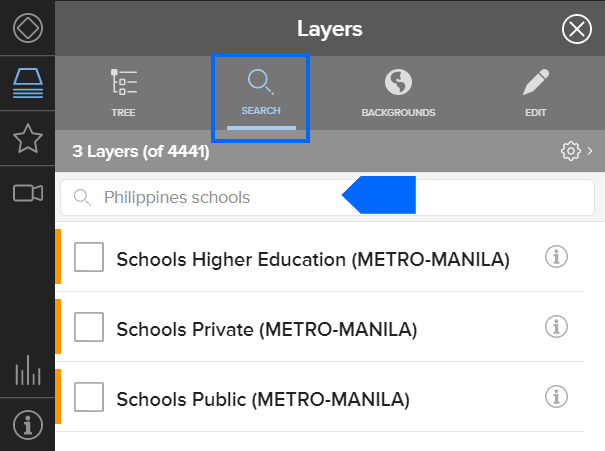

### Hazards panel and search

|                                                                                                  |                                                                                                                                                                                   |
| ------------------------------------------------------------------------------------------------ | --------------------------------------------------------------------------------------------------------------------------------------------------------------------------------- |
|  | Click the **Hazard** icon on the left toolbar to display a list of current hazards. Use the search window to filter or search active hazards by name, hazard type, location, etc. |

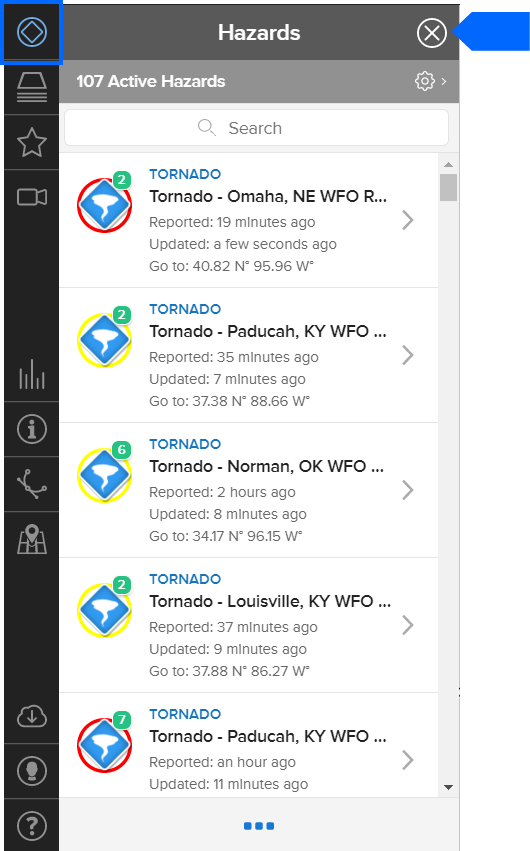

Click on the Go to: coordinates to quickly zoom to a hazard.

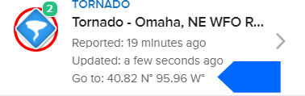

### Location search

|                                                                                                  |                                                                                                                                                                                  |
| ------------------------------------------------------------------------------------------------ | -------------------------------------------------------------------------------------------------------------------------------------------------------------------------------- |
|  | Click the map tool on the left toolbar to search for a location by name or to enter coordinates for a location, and choose either the **Places** tab or the **Coordinates tab**. |

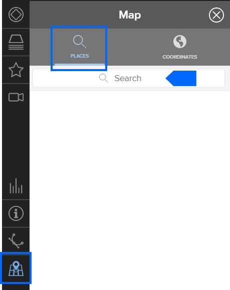

### 

### Overview Map

In the bottom of the right hand corner is an **Overview Map** that depicts the current zoom extent in relation to the surrounding geographic region. You can minimize (hide) or maximize (expand) this feature.

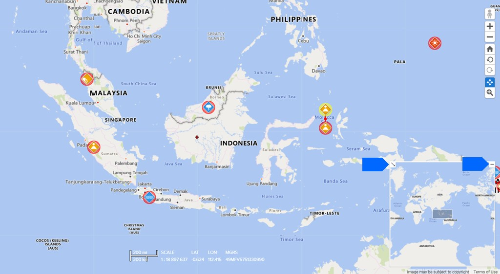

### Street View (Google) or Streetside (Bing)

Google’s Street View allows you to see a three-dimensional representation of any point on the map. Click and drag the person icon to the street location you want to view. Areas where Street View is available will be highlighted in blue and the Street View icon will turn green when hovering over a valid Street View location.

Note: This feature requires you to be zoomed into your desired point in order to find valid Street View locations.

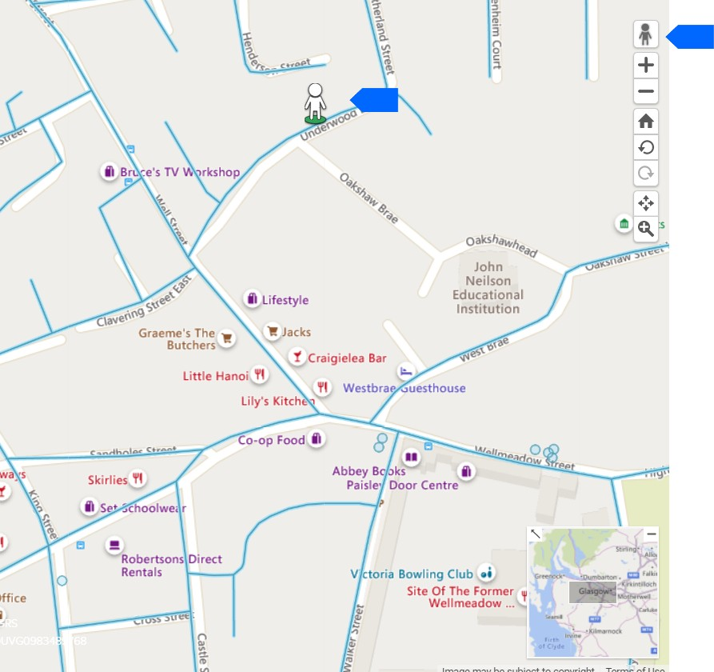

##   
Receive early warning with SmartAlert™

### Sign up for SmartAlert Notifications

Get early warning alerts via text and/or email for potential disasters happening anywhere around globe.

|                                         |                                                                                                    |
| --------------------------------------- | -------------------------------------------------------------------------------------------------- |
|  | Click the **User icon from the left toolbar, then click Preferences \> SmartAlert Notifications**. |

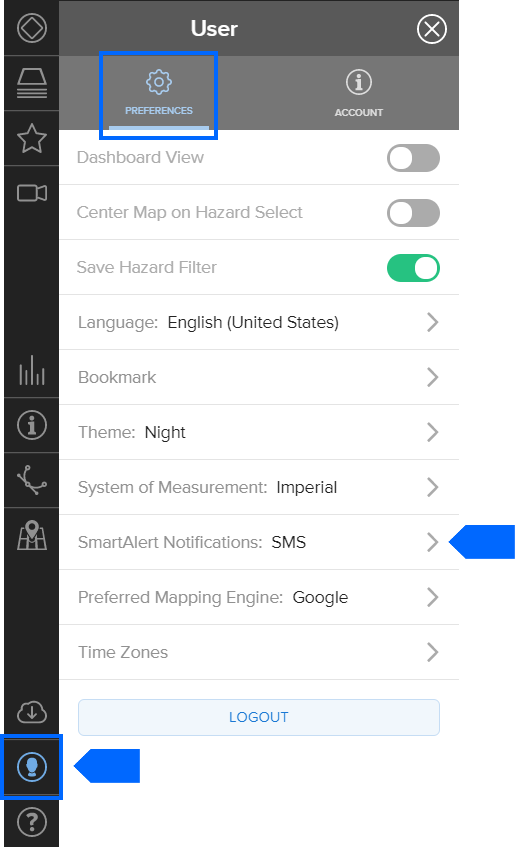

While in the **SmartAlert Preferences** panel, click the **Channels tab** to choose email, SMS (text), or both types of alerts. Click the **Information Icon** to add your email and phone number contact details for alerts. Be sure to select the **Send a Test Message** option to confirm a successful SMS sign up. Your email sign up can use a separate email from your registration email, such as a personal or group account. Be sure to select the **Send a verification email** option to confirm your email.

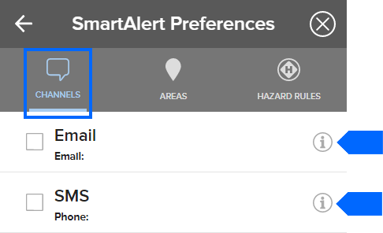

### Specify hazards and severities for alerts

|                                                                                                          |                                                                                                                                                                             |
| -------------------------------------------------------------------------------------------------------- | --------------------------------------------------------------------------------------------------------------------------------------------------------------------------- |
|  | While in the **SmartAlert Preferences panel**, click the **Hazard Rules** tab. Next, choose the types of hazards and severities for which you would like to receive alerts. |

<table>
<tbody>
<tr class="odd">
<td>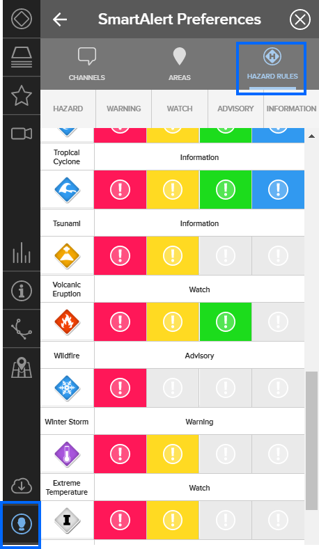</td>
<td>

</td>
<td>
<strong>Information</strong>: Lowest severity impact

<strong>Advisory:</strong> Impact is either not likely or not very large.

<strong>Watch:</strong> Likely impact with moderate damage.

<strong>Warning:</strong> Highest severity impact. Damage is highly likely.
</td>
</tr>
</tbody>
</table>

### Select geographic areas for alerts

|   | Click the **User** icon from the left toolbar to open then **SmartAlert Preferences** panel.                                                                                                                                                                       |
| ---------------------------------------- | ------------------------------------------------------------------------------------------------------------------------------------------------------------------------------------------------------------------------------------------------------------------ |
|  | Click the **Areas** tab Then choose the types of hazards and severities for which you would like to receive alerts. You may define one or more alert areas by clicking **User \> Preferences \> SmartAlert Notifications \> Areas** and using the following tools. |

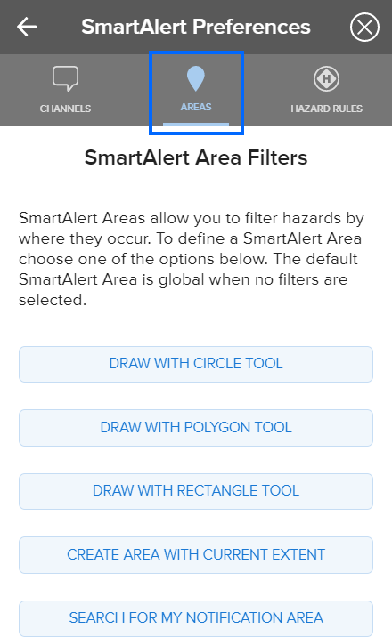

### Choose multiple areas for alerts

To add additional areas, click on the **Plus Icon** next to Search, then select the area tool you want to add: (from left to right)

  - Circle

  - Polygon

  - Rectangle

  - Current extents

  - or Search Locations

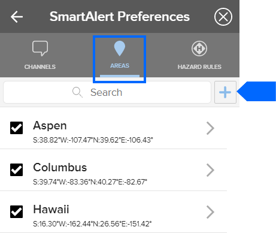

### How to unsubscribe from alerts

To unsubscribe from alerts, uncheck the alert you want to remove. To quickly remove SmartAlerts sent via SMS (text) messages, each alert includes the option to opt out by hitting reply and typing the words “STOP.”

## Account, language, and time zone preferences

|                                         |                                                                                                   |
| --------------------------------------- | ------------------------------------------------------------------------------------------------- |
|  | Click the **User Icon** on the bottom of the left toolbar to personalize your workspace settings. |

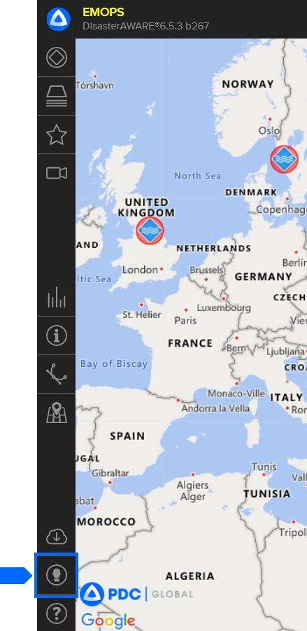

### Change or update your account email and phone number

|                                                                      |                                                                                                                                                                                                                                                                                                                        |
| -------------------------------------------------------------------- | ---------------------------------------------------------------------------------------------------------------------------------------------------------------------------------------------------------------------------------------------------------------------------------------------------------------------- |
| 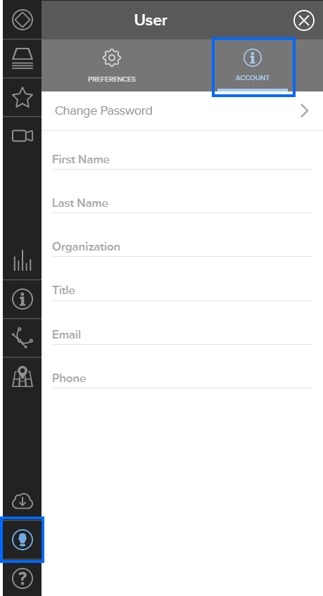 | Choose **User \> Account \> Account** tab to change your account information. This information is not associated with your SmartAlert email or SMS (text) preferences. See the section above on how to setup or change [SmartAlert preferences](https://disasteraware.luigibella.com/tutorial/smartalert/#SmartAlert). |

### 

### Change or reset your password  

|                                         |                                                                                                                                                                                                                                                           |
| --------------------------------------- | --------------------------------------------------------------------------------------------------------------------------------------------------------------------------------------------------------------------------------------------------------- |
|  | Click the **User** icon from the left toolbar, then click the **Account** **tab \> Change Password**, to change your password. Enter your existing password, then enter your new password, confirm your new password, and then click **Submit Password**. |

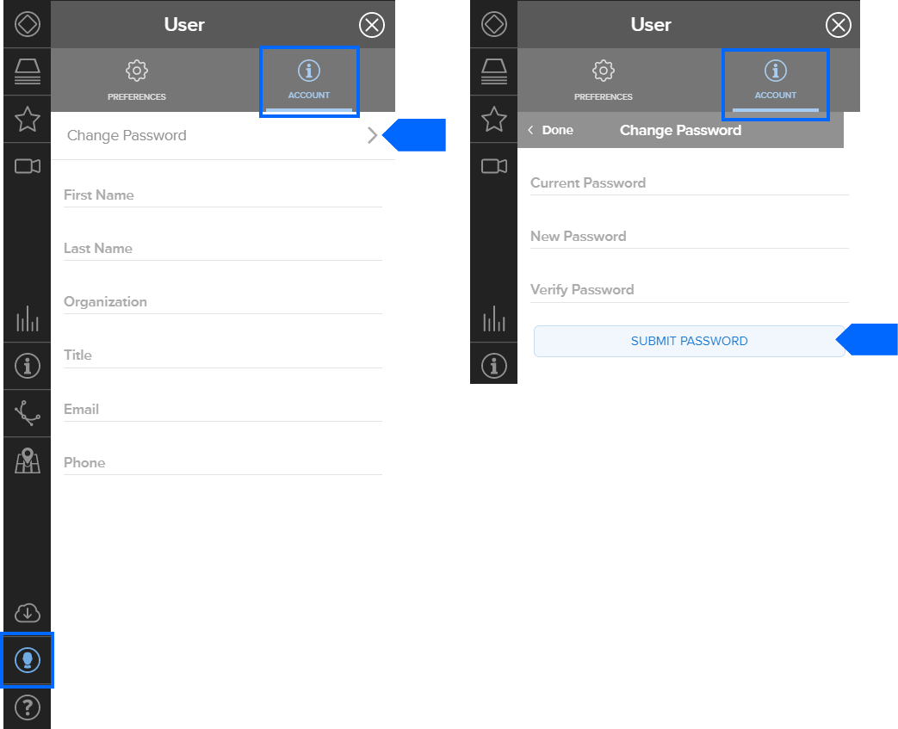

### Define language preferences

To set your language preferences, click **User \> Preferences \> Language**.

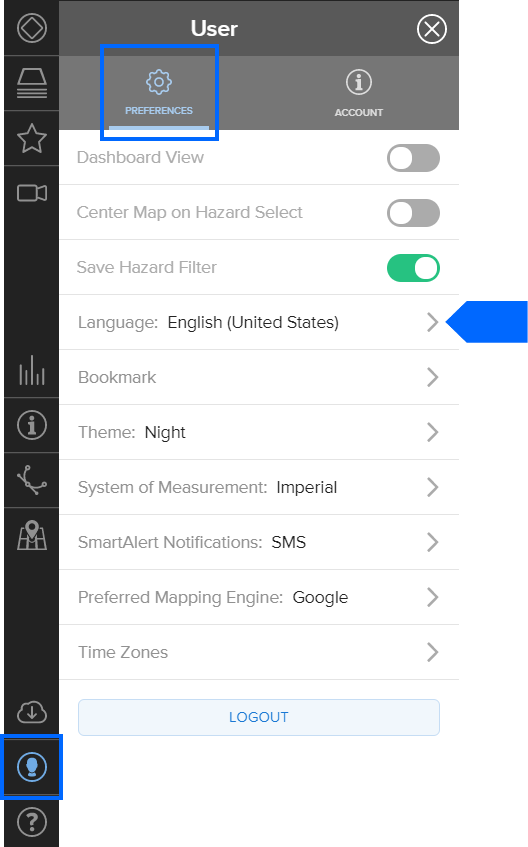

Select your language and click **Done**.

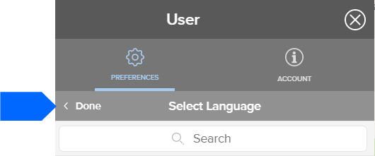

### View multiple time zones for areas you wish to monitor

If you would like to monitor hazards in multiple time zones, you can add several clocks to your display.

|                                         |                                                                                            |
| --------------------------------------- | ------------------------------------------------------------------------------------------ |
|  | Click the **User** icon from the left toolbar, and then the **Preferences \> Time Zones**. |

You can add up to five time zones. Click the arrow to the right of a time zone (pictured above), to change it to a different time zone. When adding time zones, you can rename the time zone from the location it represents to a specific asset you’re monitoring (e.g. Headquarters).

To change the clock order, click and hold on the three lines next to a location and drag up or down to change the clock order.

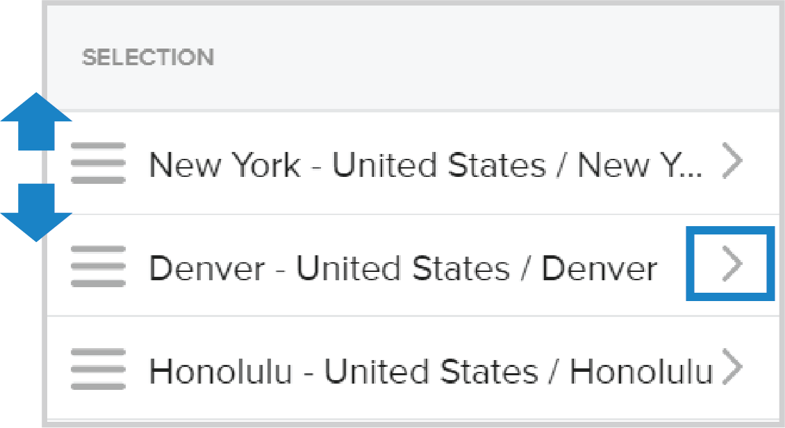

**Pro tip:**

|                                                                                                 |                                                                                                                                                                                           |
| ----------------------------------------------------------------------------------------------- | ----------------------------------------------------------------------------------------------------------------------------------------------------------------------------------------- |
| 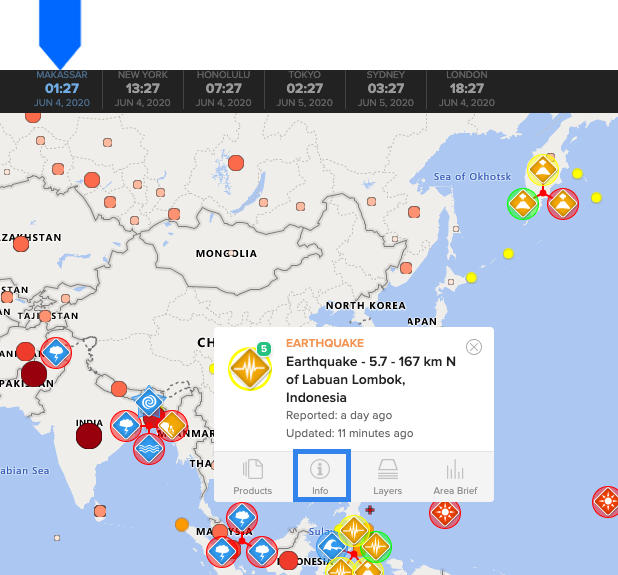 | When you click a hazard icon on the map, and the **Info** link from the hazard tooltip, the time zone will automatically switch from UTC to the time zone in which the hazard is located. |

###   

### How to delete a time zone

Click a time zone from the list you created and then hit the delete button.

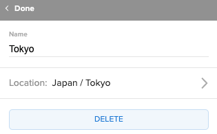
